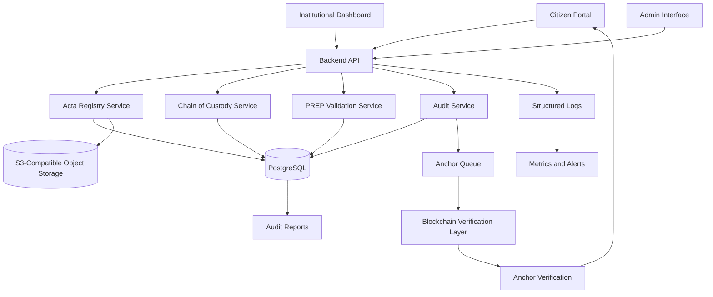
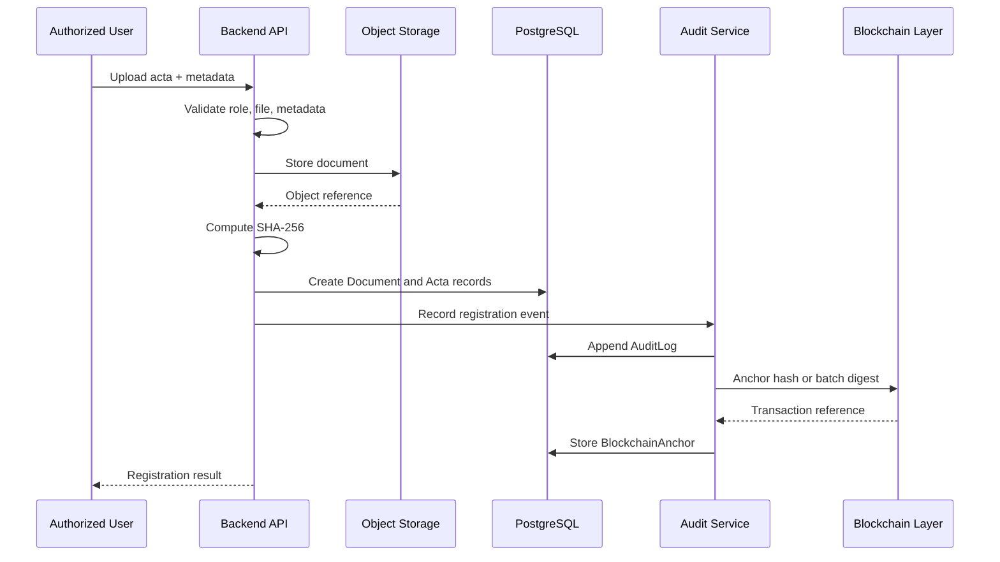
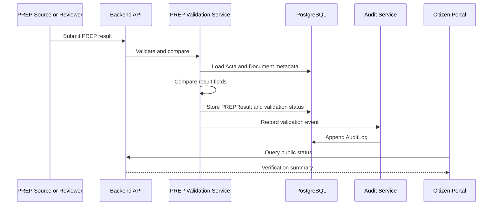
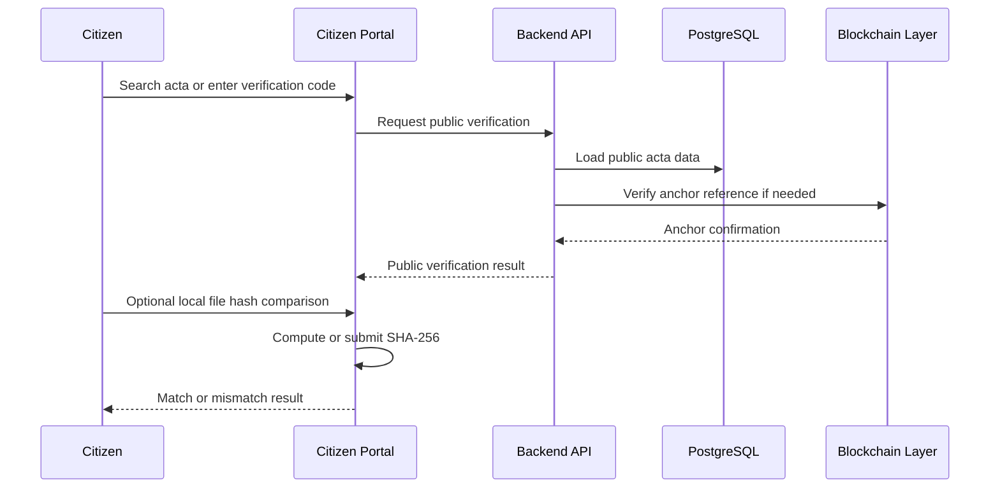

# Phase 0 — ActaTrace Foundation

## 1. Executive Summary

ActaTrace is a public-sector electoral traceability system for registering, preserving, verifying, and auditing electoral acta evidence from polling stations through preliminary result publication and institutional review.

The system exists to reduce uncertainty around electoral evidence. It does not cast votes, count votes, replace official electoral systems, or turn blockchain into an electoral database. Its role is narrower and more defensible: record source evidence, compute verifiable hashes, track chain-of-custody events, compare PREP data against registered actas, and expose citizen-facing verification tools.

ActaTrace uses blockchain only as a tamper-evident verification layer. PostgreSQL remains the system of record, object storage holds document files, and the blockchain anchors hashes and selected critical events so an auditor or citizen can later verify that evidence has not been silently altered.

## 2. Problem Definition

Electoral processes depend on trust in documents, timestamps, responsible actors, and public explanations. When that trust is weak, even technically correct results may be challenged.

Key problems ActaTrace addresses:

- **Lack of trust in preliminary results:** Citizens, parties, observers, and institutions may not have a clear way to connect PREP figures back to source actas.
- **Possible document tampering:** Digital acta images or metadata can be modified after capture if there is no independently verifiable integrity proof.
- **Weak chain of custody visibility:** Physical and digital transfers are often documented internally, but not always in a consistent, queryable, auditable format.
- **Limited citizen verification:** Public users may see published results without a practical way to validate document hashes, timestamps, source metadata, and traceability status.
- **Difficulty auditing acta changes:** Corrections, replacements, OCR updates, manual reviews, and validation changes need explicit event histories.
- **Inconsistent traceability between acta, PREP, and final computation:** Preliminary figures, source documents, metadata, and later official computation may diverge without a clear reconciliation trail.

## 3. System Objective

The main objective of ActaTrace is to provide a secure, auditable, and publicly understandable traceability layer for electoral acta evidence and PREP verification.

ActaTrace must:

- Register electoral evidence and metadata.
- Generate deterministic SHA-256 hashes for documents and critical payloads.
- Track chain-of-custody events across physical and digital handling.
- Validate PREP results against source acta data.
- Enable citizen verification of acta existence, hash integrity, timestamps, and status.
- Create tamper-evident audit trails for institutional and public review.

## 4. Scope

### 4.1 Included in MVP

The MVP includes:

- Acta upload and registration.
- SHA-256 document hashing.
- Acta metadata registry.
- Chain-of-custody event tracking.
- PREP result capture and validation.
- Audit log generation.
- Blockchain hash anchoring.
- Citizen verification portal.
- Institutional dashboard.

### 4.2 Explicitly Excluded

The MVP explicitly excludes:

- Electronic voting.
- Vote casting.
- Ballot secrecy management.
- Blockchain-based voting.
- Storing full documents on blockchain.
- Replacing official electoral systems.
- Complex AI-based fraud detection in Phase 0.

## 5. Architectural Principles

These principles are non-negotiable:

- **Auditability first, blockchain second:** The system must be understandable and auditable without relying on blockchain terminology as a substitute for sound design.
- **Blockchain is not the primary database:** PostgreSQL stores operational state, relational integrity, permissions, and queryable audit data.
- **Store hashes, not documents, on-chain:** Full documents stay in controlled object storage. Blockchain anchors only hashes and minimal non-sensitive references.
- **Evidence must be independently verifiable:** A third party must be able to recompute a document hash and compare it to registered and anchored values.
- **Every critical action must be logged:** Uploads, reviews, custody transfers, validation decisions, PREP comparisons, and anchor submissions must create audit events.
- **Public transparency without exposing sensitive data:** Citizen views expose verification facts, not restricted personal, operational, or security-sensitive details.
- **Modular architecture:** Components must be separable by responsibility without prematurely splitting into microservices.
- **Production-oriented design, not demo-first design:** Phase 0 decisions must support deployment, governance, monitoring, security, and institutional review.

## 6. High-Level Architecture

ActaTrace should begin as a modular monolith with clear internal boundaries. This avoids premature microservice complexity while preserving future separation options.

### 6.1 Frontend Layer

- **Citizen portal:** Public search and verification for actas, hashes, timestamps, and traceability status.
- **Institutional dashboard:** Authenticated monitoring of acta registration, PREP validation, inconsistencies, missing documents, and custody status.
- **Admin interface:** Restricted user, role, configuration, and audit administration.

### 6.2 Backend Layer

- **API services:** REST endpoints for acta registration, verification, custody events, PREP validation, dashboard views, and admin workflows.
- **Business logic:** Domain services for acta lifecycle, custody validation, PREP comparison, and status transitions.
- **Validation services:** Input validation, metadata validation, file integrity checks, duplicate detection, and consistency rules.
- **Audit services:** Centralized audit event creation, immutable log persistence, and blockchain anchor requests.

### 6.3 Data Layer

- **PostgreSQL as system of record:** Relational state for actas, users, roles, custody events, PREP results, anchors, and audit logs.
- **Object storage for documents:** S3-compatible storage for acta files, with encryption, access controls, retention policies, and integrity metadata.
- **Immutable audit tables:** Append-only audit records with hash chaining or event digests to detect unauthorized changes.

### 6.4 Blockchain Layer

- **Hash anchoring:** Anchor document hashes and batch digests, not files.
- **Critical event anchoring:** Anchor selected custody, registration, and PREP validation event digests.
- **Verification interface:** Read blockchain transaction data and compare anchored hashes against database records and recomputed document hashes.

### 6.5 Observability Layer

- **Structured logs:** JSON logs for API requests, domain events, security-relevant actions, and anchor operations.
- **Metrics:** Upload counts, validation counts, mismatch rates, anchor latency, API latency, storage failures, and queue depth.
- **Alerts:** Failed anchoring, repeated hash mismatches, elevated error rates, suspicious access patterns, and missing acta thresholds.
- **Audit reports:** Exportable reports for institutional review, public summaries, and legal audit support.



## 7. Core Components

### 7.1 Acta Registry

**Purpose:** Register electoral actas and their document hashes as the foundation for later verification.

**Responsibilities:**

- Accept acta document uploads.
- Validate file type, size, metadata completeness, and polling station references.
- Generate SHA-256 hashes from canonical file bytes.
- Detect duplicate or conflicting acta registrations.
- Store document references, metadata, and lifecycle status.
- Emit audit and anchor events.

**Inputs:**

- Acta document file.
- Polling station identifier.
- Electoral process metadata.
- Captured vote totals or structured acta fields when available.
- Uploading user identity.

**Outputs:**

- Registered acta record.
- Document hash.
- Storage object reference.
- Audit log entry.
- Blockchain anchor request.

**Risks:**

- Bad metadata can undermine traceability.
- File normalization errors can cause hash mismatches.
- Duplicate uploads may create public confusion if not clearly versioned.
- Unauthorized uploads can contaminate the evidence registry.

### 7.2 Chain of Custody

**Purpose:** Track responsibility, movement, verification, and status changes for electoral evidence.

**Responsibilities:**

- Record physical and digital custody events.
- Capture responsible actor, timestamp, source, destination, and event type.
- Validate required evidence before status transitions.
- Preserve event history without destructive updates.
- Link custody events to audit logs and blockchain anchors where appropriate.

**Inputs:**

- Acta or document reference.
- Custody event type.
- Responsible user or institution.
- Transfer metadata.
- Supporting notes or evidence references.

**Outputs:**

- Custody event record.
- Updated acta custody status.
- Audit log entry.
- Optional event digest anchor.

**Risks:**

- Incomplete event capture can create audit gaps.
- Identity misuse can falsify responsibility.
- Offline handling may produce delayed or conflicting events.
- Overexposing custody details can create operational security risks.

### 7.3 PREP Validation

**Purpose:** Compare captured preliminary results against registered acta data and surface mismatches.

**Responsibilities:**

- Store PREP result captures.
- Link PREP data to the corresponding acta and polling station.
- Compare structured PREP fields against acta fields.
- Flag missing, mismatched, duplicate, or inconsistent records.
- Preserve validation history and reviewer decisions.

**Inputs:**

- PREP result payload.
- Acta reference.
- Polling station reference.
- Validation rules.
- Reviewer identity when manual action is needed.

**Outputs:**

- Validation result.
- Mismatch classification.
- Dashboard status.
- Audit log entry.
- Optional anchor digest for finalized validation events.

**Risks:**

- OCR or manual capture errors may appear as irregularities.
- Rule ambiguity can produce inconsistent validation results.
- Premature public mismatch display can be misinterpreted without context.
- External PREP data imports may be incomplete or delayed.

### 7.4 Audit System

**Purpose:** Record relevant actions and state changes in a tamper-evident event history.

**Responsibilities:**

- Centralize audit event creation.
- Record actor, action, entity, previous state, new state, timestamp, request metadata, and digest.
- Support immutable append-only storage.
- Generate audit reports.
- Feed blockchain anchoring for selected critical events or batches.

**Inputs:**

- Domain events.
- Authentication context.
- Entity state snapshots or diffs.
- Request metadata.

**Outputs:**

- AuditLog record.
- Event digest.
- Batch anchor request.
- Audit report data.

**Risks:**

- Logging too little weakens auditability.
- Logging too much may expose sensitive data.
- Mutable audit logs can invalidate institutional credibility.
- Missing correlation IDs make investigations difficult.

### 7.5 Citizen Portal

**Purpose:** Allow public verification of actas, hashes, timestamps, registration status, and traceability information.

**Responsibilities:**

- Provide search by public acta identifier, polling station, district, or verification code.
- Display public metadata, document hash, registration timestamp, anchor status, and verification result.
- Allow citizens to compare a local file hash against the registered hash when legally appropriate.
- Explain status and mismatch classifications in plain language.

**Inputs:**

- Public search query.
- Optional citizen-provided file for local hash comparison.
- Verification code or acta identifier.

**Outputs:**

- Public verification result.
- Hash match or mismatch result.
- Chain-of-custody summary.
- PREP validation summary.

**Risks:**

- Poor wording can cause public misunderstanding.
- Public endpoints can be abused through scraping or denial-of-service attempts.
- Exposing sensitive metadata can create privacy or security problems.
- File upload for hash checking must avoid server-side storage unless explicitly required.

### 7.6 Institutional Dashboard

**Purpose:** Help authorized users monitor registration progress, inconsistencies, missing actas, custody status, and verification outcomes.

**Responsibilities:**

- Show acta registration coverage.
- Surface missing, duplicate, mismatched, and pending records.
- Track custody status by region, district, and polling station.
- Provide audit drill-downs for authorized roles.
- Support exportable reports for institutional review.

**Inputs:**

- Authenticated user context.
- Dashboard filters.
- Acta, custody, PREP, audit, and anchor data.

**Outputs:**

- Operational dashboards.
- Exception queues.
- Reports and exports.
- Review task lists.

**Risks:**

- Weak authorization can expose restricted electoral operations.
- Bad dashboard aggregation can hide critical exceptions.
- High-latency queries can degrade institutional monitoring.
- Exported reports may leak sensitive information if not scoped by role.

## 8. Key Workflows

### 8.1 Acta Registration Workflow

1. Authorized user selects electoral process, polling station, and acta type.
2. User uploads the acta document.
3. Backend validates authentication, authorization, file constraints, and required metadata.
4. Backend stores the original document in encrypted object storage.
5. Backend computes SHA-256 from the stored canonical file bytes.
6. Backend creates the `Document` and `Acta` records in PostgreSQL.
7. Audit service records the registration event and event digest.
8. Blockchain anchoring service submits the document hash or batch digest.
9. Backend stores the blockchain transaction reference after confirmation.
10. Citizen and institutional views expose the appropriate registration and anchor status.



### 8.2 Chain of Custody Workflow

1. Authorized actor initiates a custody event for an acta or document.
2. Backend validates actor permission, current custody state, and required event data.
3. System records source, destination, timestamp, event type, responsible actor, and notes.
4. System updates the acta custody status when the transition is valid.
5. Audit service records the custody event and state change.
6. Critical custody event digests are queued for blockchain anchoring.
7. Institutional dashboard updates custody progress and exceptions.

```mermaid
sequenceDiagram
    participant Actor as Custody Actor
    participant API as Backend API
    participant Custody as Custody Service
    participant DB as PostgreSQL
    participant Audit as Audit Service
    participant Dashboard as Institutional Dashboard

    Actor->>API: Submit custody event
    API->>Custody: Validate transition
    Custody->>DB: Append CustodyEvent
    Custody->>DB: Update acta custody status
    Custody->>Audit: Emit custody audit event
    Audit->>DB: Append AuditLog
    Audit->>DB: Create anchor request if critical
    Dashboard->>API: Request custody status
    API-->>Dashboard: Updated progress and exceptions
```

### 8.3 PREP Verification Workflow

1. PREP result is captured manually, imported from an authorized source, or entered by a reviewer.
2. Backend validates the polling station, acta linkage, result format, and authorization context.
3. PREP validation service retrieves the registered acta data.
4. Service compares PREP fields against acta fields using approved validation rules.
5. System classifies the result as matched, mismatched, missing source acta, duplicate, pending review, or invalid payload.
6. Audit service records the validation result and any state transition.
7. Dashboard surfaces mismatches and pending review queues.
8. Public portal may show a scoped verification status after institutional rules permit publication.



### 8.4 Citizen Verification Workflow

1. Citizen searches by acta identifier, polling station metadata, district, or verification code.
2. Backend retrieves public acta metadata, document hash, registration timestamp, anchor status, and PREP validation summary.
3. If the citizen provides a local file for comparison, the browser or backend computes SHA-256 according to the approved implementation.
4. System compares the provided hash to the registered hash.
5. Portal displays match, mismatch, unavailable, or pending anchor status with plain-language explanations.
6. Audit service records public verification activity at an aggregate or privacy-preserving level.



## 9. Initial Domain Model

### Acta

**Purpose:** Represents the electoral acta as a traceable institutional evidence object.

**Key fields:** `id`, `public_id`, `electoral_process_id`, `polling_station_id`, `document_id`, `acta_type`, `status`, `custody_status`, `registered_by_user_id`, `registered_at`, `created_at`, `updated_at`.

**Relationships:** Belongs to `PollingStation`; references one primary `Document`; has many `CustodyEvent`, `PREPResult`, `AuditLog`, and `BlockchainAnchor` records.

**Audit relevance:** Central entity for reconstructing registration, custody, verification, and PREP validation history.

### Document

**Purpose:** Represents a stored file and its integrity metadata.

**Key fields:** `id`, `storage_provider`, `storage_bucket`, `storage_key`, `sha256_hash`, `mime_type`, `file_size_bytes`, `original_filename`, `uploaded_by_user_id`, `uploaded_at`, `created_at`.

**Relationships:** May be linked to one or more `Acta` records depending on versioning rules; has many `BlockchainAnchor` and `AuditLog` records.

**Audit relevance:** Enables independent file integrity verification through SHA-256.

### PollingStation

**Purpose:** Represents the polling station or electoral unit associated with an acta.

**Key fields:** `id`, `public_code`, `state`, `district`, `municipality`, `section`, `station_type`, `location_reference`, `created_at`, `updated_at`.

**Relationships:** Has many `Acta` and `PREPResult` records.

**Audit relevance:** Provides the geographic and electoral context needed to reconcile actas, PREP entries, and missing records.

### CustodyEvent

**Purpose:** Represents a chain-of-custody event for an acta or document.

**Key fields:** `id`, `acta_id`, `document_id`, `event_type`, `from_party`, `to_party`, `performed_by_user_id`, `event_timestamp`, `notes`, `evidence_reference`, `event_hash`, `created_at`.

**Relationships:** Belongs to `Acta`; may reference `Document`; created by `User`; has related `AuditLog` and optional `BlockchainAnchor`.

**Audit relevance:** Provides traceability of responsibility, transfer, validation, and custody status.

### PREPResult

**Purpose:** Represents preliminary result data associated with a polling station and acta.

**Key fields:** `id`, `acta_id`, `polling_station_id`, `source`, `captured_totals_json`, `validation_status`, `mismatch_details_json`, `captured_by_user_id`, `captured_at`, `created_at`, `updated_at`.

**Relationships:** Belongs to `Acta` and `PollingStation`; has many `AuditLog` records; may have an associated `BlockchainAnchor` for finalized validation digests.

**Audit relevance:** Links preliminary results to source evidence and preserves validation outcomes.

### AuditLog

**Purpose:** Immutable event record for important actions and state transitions.

**Key fields:** `id`, `actor_user_id`, `action`, `entity_type`, `entity_id`, `previous_state_json`, `new_state_json`, `request_id`, `ip_address_hash`, `user_agent_hash`, `event_hash`, `created_at`.

**Relationships:** References `User` when applicable; points to entities by type and ID; may be included in `BlockchainAnchor` batches.

**Audit relevance:** Supports historical reconstruction, investigation, reporting, and tamper detection.

### BlockchainAnchor

**Purpose:** Stores references to blockchain transactions anchoring hashes or event digests.

**Key fields:** `id`, `anchor_type`, `entity_type`, `entity_id`, `hash_value`, `network`, `transaction_hash`, `block_number`, `confirmation_status`, `submitted_at`, `confirmed_at`, `created_at`.

**Relationships:** References `Acta`, `Document`, `CustodyEvent`, `PREPResult`, or audit batch by typed reference.

**Audit relevance:** Provides external tamper-evidence for registered hashes and selected critical events.

### User

**Purpose:** Represents an authenticated institutional actor or administrator.

**Key fields:** `id`, `email`, `name`, `institution`, `status`, `last_login_at`, `created_at`, `updated_at`.

**Relationships:** Has many role assignments; creates documents, actas, custody events, PREP results, and audit logs.

**Audit relevance:** Establishes accountability for sensitive actions.

### Role

**Purpose:** Defines permission groups for system access.

**Key fields:** `id`, `code`, `name`, `description`, `permissions_json`, `created_at`, `updated_at`.

**Relationships:** Assigned to many `User` records through a join table.

**Audit relevance:** Determines whether actions were authorized at the time they occurred.

## 10. Risk Analysis

### 10.1 Technical Risks

| Risk | Description | Impact | Mitigation |
| --- | --- | --- | --- |
| Blockchain latency | Transactions may confirm slowly or unpredictably. | Delayed public anchor confirmation and operational uncertainty. | Use asynchronous anchor queues, pending states, retries, and batch anchoring. |
| Hash mismatch errors | Hashes can differ due to file transformation, wrong canonicalization, corruption, or user comparing the wrong file. | False allegations of tampering or invalid verification results. | Hash exact stored bytes, preserve originals, document hashing rules, and expose clear mismatch explanations. |
| Storage compromise | Object storage access or configuration may be compromised. | Document exposure, deletion, or replacement attempts. | Use encryption, strict IAM, object versioning, retention policies, access logs, backups, and hash verification. |
| Poor key management | Blockchain signing keys or application secrets may be mishandled. | Unauthorized anchors, service compromise, or loss of signing ability. | Use KMS or HSM-backed keys, rotation policies, least privilege, secret scanning, and access reviews. |
| API abuse | Public verification and upload endpoints may be abused. | Denial of service, scraping, cost spikes, or operational disruption. | Rate limiting, WAF rules, CAPTCHA where appropriate, request quotas, structured monitoring, and abuse alerts. |

### 10.2 Political / Institutional Risks

| Risk | Description | Impact | Mitigation |
| --- | --- | --- | --- |
| Institutional resistance | Electoral bodies may see the system as disruptive or duplicative. | Slow adoption or rejection. | Position ActaTrace as an auditability layer, not a replacement; involve institutions early; provide governance documentation. |
| Misinterpretation as electronic voting | Public or political actors may assume blockchain means vote casting. | Misinformation and reputational damage. | Use clear public messaging: no vote casting, no ballot secrecy handling, no blockchain voting. |
| Lack of legal recognition | Anchored hashes may not automatically have evidentiary standing. | Reduced formal audit value. | Produce legal audit documentation, chain-of-custody records, and align with applicable electoral evidence rules. |
| Public distrust if poorly explained | Technical verification may be misunderstood. | Increased skepticism despite better traceability. | Use plain-language citizen portal copy, public FAQs, independent observer training, and transparent limitation statements. |

### 10.3 Operational Risks

| Risk | Description | Impact | Mitigation |
| --- | --- | --- | --- |
| Bad data capture | Users may enter wrong metadata or PREP values. | Mismatches, false alerts, and reconciliation delays. | Use validation rules, double-entry review where needed, import checks, required fields, and reviewer queues. |
| Poor training | Operators may misuse workflows or skip custody events. | Audit gaps and inconsistent process execution. | Provide role-based training, workflow checklists, operational manuals, and staged rollout. |
| Missing documents | Some actas may not be uploaded or may be delayed. | Incomplete verification coverage. | Track expected actas, show missing queues, alert by region, and support documented exception handling. |
| Network outages | Uploads or anchor submissions may fail in low-connectivity environments. | Delayed registration and verification. | Support resumable uploads, offline capture planning, retry queues, and delayed anchoring states. |
| Identity misuse | Shared accounts or compromised credentials can falsify accountability. | Weak non-repudiation and audit credibility. | Enforce MFA, unique accounts, session controls, least privilege, access reviews, and suspicious login alerts. |

## 11. Non-Functional Requirements

### 11.1 Security

- Authentication is required for all institutional and admin operations.
- Authorization must use server-side RBAC and least privilege.
- Sensitive configuration must be stored in environment variables or a secrets manager.
- Documents must be encrypted at rest and in transit.
- Public endpoints must not expose restricted personal, operational, or security-sensitive data.
- Critical events must be recorded in tamper-evident audit logs.
- Upload endpoints must validate type, size, content, and authorization before storage.
- Admin actions must require MFA and produce high-fidelity audit events.

### 11.2 Auditability

- Every acta, document, custody event, PREP validation, role change, and anchor operation must be traceable.
- Audit logs must be append-only at the application level.
- Historical reconstruction must show who did what, when, from where, and what changed.
- Hashes must allow independent verification of stored documents.
- Blockchain anchors must be linked back to internal records and verification states.

### 11.3 Availability

- Target uptime for core verification services should be at least 99.5% during MVP operation, with higher targets for election windows after hardening.
- Public verification should degrade gracefully if blockchain confirmation checks are temporarily unavailable.
- Upload and anchoring workflows should support retry queues.
- Recovery plans must include database backups, object storage versioning, and anchor reconciliation jobs.

### 11.4 Performance

- Standard API requests should respond in under 500 ms at p95 excluding large uploads and blockchain confirmation waits.
- Document upload limits must be explicit and configurable.
- Hash generation must be streamed or handled efficiently to avoid memory pressure.
- Citizen verification queries should return current database verification status quickly, with blockchain checks cached or performed asynchronously where appropriate.

### 11.5 Scalability

- The system must support thousands of polling stations and actas without schema redesign.
- Reads for citizen verification should be cacheable and horizontally scalable.
- Upload processing, hashing, PREP validation, and blockchain anchoring should be queue-friendly.
- PostgreSQL indexes must support common queries by public acta ID, polling station, district, status, hash, and timestamps.
- Object storage must scale independently from application servers.

### 11.6 Compliance Readiness

- Maintain architecture notes, data flow diagrams, role definitions, audit policies, and operational runbooks.
- Preserve evidence through retention policies and documented deletion restrictions.
- Support exportable audit reports for legal, institutional, and observer review.
- Keep trace logs for authentication, authorization, file handling, custody events, PREP validation, and anchor operations.
- Document known limitations so verification results are not overstated.

## 12. Initial Technology Stack

| Area | Recommendation | Justification |
| --- | --- | --- |
| Backend | FastAPI or Django REST Framework | FastAPI is strong for explicit typed APIs and async workflows; Django REST Framework is stronger if admin, auth, and institutional CRUD speed are dominant. Both are production-proven. |
| Frontend | Next.js or React | Next.js supports public portal SEO, server rendering, and dashboards; React with Vite is adequate for internal dashboards and prototypes. |
| Database | PostgreSQL | Reliable relational system of record with strong indexing, constraints, JSONB support, audit modeling, and operational maturity. |
| Storage | S3-compatible object storage | Scalable, durable, encrypted document storage with versioning, lifecycle policies, and provider portability. |
| Hashing | SHA-256 | Widely supported, deterministic, strong enough for document integrity verification, and easy for third parties to recompute. |
| Blockchain | Hyperledger Fabric, Polygon testnet, or private Ethereum-compatible network | Hyperledger Fabric fits permissioned institutional contexts; Polygon testnet is useful for public prototype anchoring; a private Ethereum-compatible network offers EVM tooling with controlled governance. |
| Infrastructure | Docker + Terraform | Docker standardizes local and deployment environments; Terraform makes infrastructure repeatable and reviewable. |
| Observability | Prometheus + Grafana | Production-proven metrics, dashboards, alerts, and operational visibility. |
| Authentication | JWT + RBAC | Practical for API-first dashboards and portals; RBAC supports institutional permissions and audit accountability. |

Recommended MVP default: FastAPI, PostgreSQL, S3-compatible storage, Next.js, Docker, Prometheus, Grafana, JWT with RBAC, and a blockchain provider behind an internal facade so the network can change without rewriting domain logic.

## 13. Design Patterns to Use Later

- **Singleton:** Use for process-wide configuration and the blockchain client where controlled lifecycle and connection reuse are important.
- **Factory:** Use for audit event and custody event creation so event structure remains consistent across modules.
- **Strategy:** Use for storage providers and blockchain providers, allowing S3-compatible storage or blockchain networks to change behind stable interfaces.
- **Observer:** Use for audit event emission when domain actions such as acta registration or PREP validation need audit and anchor side effects.
- **Facade:** Use for blockchain integration so domain services call a simple anchoring interface instead of network-specific APIs.
- **Adapter:** Use for external storage APIs and future electoral system integrations, including PREP imports or official computation systems.
- **Builder:** Use for complex acta registration payloads where metadata, document references, captured results, validation rules, and audit context must be assembled safely.

## 14. Phase 0 Deliverables

### Architecture Summary

ActaTrace should start as a modular monolith with a Next.js or React frontend, FastAPI or Django REST backend, PostgreSQL system of record, S3-compatible document storage, immutable audit logging, and blockchain anchoring through a facade.

### MVP Scope

The MVP must cover acta upload, SHA-256 hashing, metadata registration, chain-of-custody tracking, PREP result validation, audit log generation, blockchain hash anchoring, citizen verification, and institutional monitoring.

### Domain Model Draft

The initial model includes `Acta`, `Document`, `PollingStation`, `CustodyEvent`, `PREPResult`, `AuditLog`, `BlockchainAnchor`, `User`, and `Role`.

### Risk Register

The initial risk register covers technical risks, political and institutional risks, and operational risks with mitigations for latency, storage security, key management, misinformation, legal recognition, training, missing documents, outages, and identity misuse.

### Technology Recommendation

Use practical, production-proven tools: FastAPI or Django REST Framework, Next.js or React, PostgreSQL, S3-compatible storage, SHA-256, Docker, Terraform, Prometheus, Grafana, JWT, RBAC, and a replaceable blockchain provider.

### Next-Phase Recommendations

- Define canonical status values and lifecycle transitions.
- Draft database schema with constraints, indexes, and audit behavior.
- Define API contracts for acta registration, custody events, PREP validation, and public verification.
- Define public/private data boundaries.
- Define blockchain anchor batching rules.
- Define operational runbooks for upload failures, hash mismatches, missing actas, and anchor delays.

## 15. Phase 1 Recommendation

The exact next phase should be:

**Phase 1 — Domain Model and Database Schema**

Phase 1 should build:

- Detailed entity definitions and field types.
- PostgreSQL schema draft.
- Table relationships and foreign keys.
- Required indexes for verification, dashboard, and audit queries.
- Acta lifecycle statuses.
- Custody event types and transition rules.
- PREP validation statuses and mismatch classifications.
- Audit log immutability approach.
- Blockchain anchor table and reconciliation rules.
- Public versus restricted field classification.

Phase 1 must not build yet:

- Electronic voting.
- Vote casting workflows.
- Ballot secrecy management.
- Blockchain-based voting.
- Full document storage on blockchain.
- Microservice decomposition.
- Complex AI fraud detection.
- Replacement workflows for official electoral systems.

