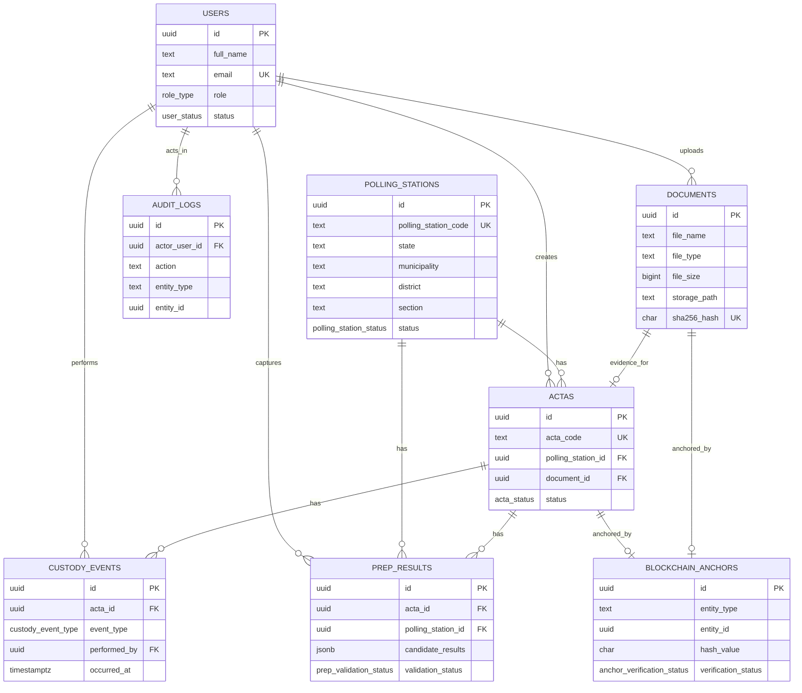
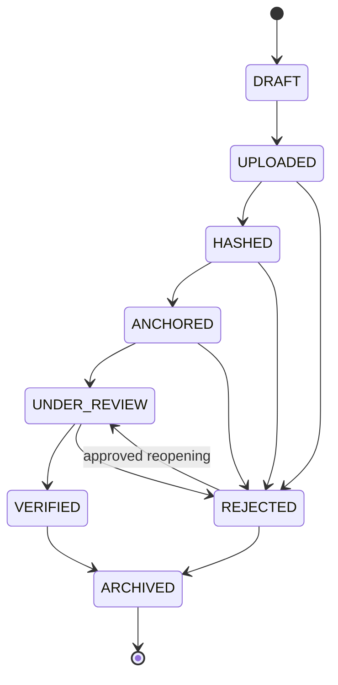
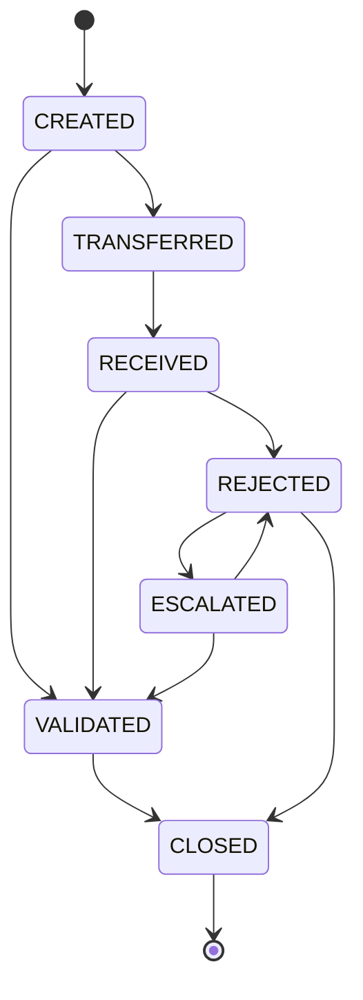
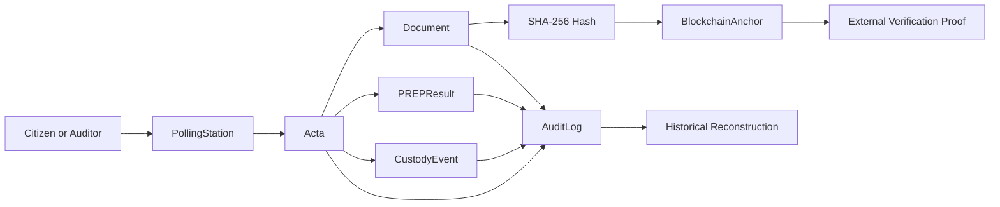

# Phase 1 — Domain Model and Database Schema

## 1. Phase Objective

Phase 1 defines the ActaTrace domain model and PostgreSQL schema with enough precision to support implementation planning without writing application code yet.

The model must support:

- Acta registration.
- Document hashing.
- Chain of custody.
- PREP result validation.
- Audit logging.
- Citizen verification.
- Future blockchain anchoring.

PostgreSQL is the system of record. Blockchain is only a verification layer for hashes and critical event digests. Phase 1 does not include electronic voting, vote casting, smart contract design, frontend implementation, or production blockchain integration.

## 2. Domain Boundaries

### 2.1 Electoral Evidence Context

Handles actas, documents, polling stations, metadata, file integrity, document hashes, and public verification identifiers.

Primary responsibilities:

- Register actas against polling stations.
- Store document metadata and SHA-256 hashes.
- Track evidence status.
- Provide stable identifiers for citizen and auditor verification.

### 2.2 Custody Context

Handles transfer, reception, validation, rejection, escalation, and closure of custody processes for electoral evidence.

Primary responsibilities:

- Record custody events.
- Preserve responsibility and location history.
- Enforce valid custody transitions.
- Link custody actions to audit events.

### 2.3 PREP Context

Handles preliminary result capture, storage, and comparison against registered acta evidence.

Primary responsibilities:

- Capture structured PREP values.
- Associate PREP results with actas and polling stations.
- Validate totals and consistency.
- Classify mismatches and pending review cases.

### 2.4 Audit Context

Handles immutable event history and forensic reconstruction.

Primary responsibilities:

- Record who did what, when, and to which entity.
- Preserve before and after state where appropriate.
- Support investigation, reporting, and legal review.
- Trigger future anchoring of critical event hashes.

### 2.5 Identity and Access Context

Handles users, roles, status, and permissions.

Primary responsibilities:

- Identify institutional actors.
- Enforce role-based access control.
- Preserve accountability for all write operations.
- Keep public users read-only.

### 2.6 Blockchain Verification Context

Handles future anchoring of document hashes, acta hashes, PREP validation digests, custody event digests, and audit batches.

Primary responsibilities:

- Store anchor metadata.
- Link anchors to auditable entities.
- Track transaction and confirmation status.
- Support independent verification without storing documents on-chain.

## 3. Core Entities

### 3.1 Acta

Represents an electoral acta registered in the system.

**Purpose:** Provide the central traceability record connecting polling station, document, lifecycle status, PREP validation, custody events, audit history, and future blockchain proof.

**Key attributes:**

- `id`
- `acta_code`
- `polling_station_id`
- `document_id`
- `status`
- `election_type`
- `municipality`
- `district`
- `section`
- `created_by`
- `created_at`
- `updated_at`
- `verified_at`
- `blockchain_anchor_id`

**Required fields:**

- `acta_code`
- `polling_station_id`
- `status`
- `election_type`
- `municipality`
- `district`
- `section`
- `created_by`

**Optional fields:**

- `document_id` while the acta is still `DRAFT`.
- `verified_at` before verification.
- `blockchain_anchor_id` before anchoring.

**Relationships:**

- Belongs to one `PollingStation`.
- Has one primary `Document`.
- Has many `CustodyEvent` records.
- Has one or many `PREPResult` records.
- May have one `BlockchainAnchor`.
- Created by one `User`.
- Referenced by many `AuditLog` records.

**Audit relevance:** The acta is the main object for reconstructing registration, evidence integrity, custody history, PREP validation, and public verification.

**Validation rules:**

- `acta_code` must be unique.
- `polling_station_id` must reference an active polling station.
- `document_id` is required before moving to `UPLOADED`, `HASHED`, `ANCHORED`, `UNDER_REVIEW`, `VERIFIED`, or `ARCHIVED`.
- `verified_at` is allowed only when status is `VERIFIED`.
- `blockchain_anchor_id` must reference an anchor whose hash belongs to the acta or its document.
- Verified actas cannot be edited directly.

### 3.2 Document

Represents the uploaded digital evidence file.

**Purpose:** Preserve file metadata, storage location, integrity hash, upload actor, and verification state.

**Key attributes:**

- `id`
- `file_name`
- `file_type`
- `file_size`
- `storage_provider`
- `storage_path`
- `sha256_hash`
- `uploaded_by`
- `uploaded_at`
- `integrity_status`

**Required fields:**

- `file_name`
- `file_type`
- `file_size`
- `storage_provider`
- `storage_path`
- `sha256_hash`
- `uploaded_by`
- `uploaded_at`
- `integrity_status`

**Optional fields:**

- None for a persisted document record. A document record should not exist without a hash.

**Relationships:**

- Uploaded by one `User`.
- May be linked to one primary `Acta`.
- May have one `BlockchainAnchor`.
- Referenced by `CustodyEvent` when supporting evidence is attached.
- Referenced by many `AuditLog` records.

**Audit relevance:** The document hash is the primary integrity proof used for citizen verification and future blockchain anchoring.

**Validation rules:**

- `sha256_hash` must be a 64-character lowercase hexadecimal string.
- `sha256_hash` is immutable after creation.
- `storage_path` must not be public-write.
- `file_size` must be positive and within configured upload limits.
- `file_type` must be in the allowed list.

### 3.3 PollingStation

Represents the polling station or casilla.

**Purpose:** Provide the electoral location and jurisdiction context for actas and PREP results.

**Key attributes:**

- `id`
- `polling_station_code`
- `state`
- `municipality`
- `district`
- `section`
- `address`
- `latitude`
- `longitude`
- `station_type`
- `status`

**Required fields:**

- `polling_station_code`
- `state`
- `municipality`
- `district`
- `section`
- `station_type`
- `status`

**Optional fields:**

- `address`
- `latitude`
- `longitude`

**Relationships:**

- Has many `Acta` records.
- Has many `PREPResult` records.
- Referenced by `AuditLog` when station metadata changes.

**Audit relevance:** Enables traceability from electoral geography to acta evidence, PREP records, missing actas, and public verification.

**Validation rules:**

- `polling_station_code` must be unique.
- `latitude` must be between -90 and 90 when provided.
- `longitude` must be between -180 and 180 when provided.
- Inactive polling stations cannot receive new actas unless explicitly reopened by an administrator.

### 3.4 CustodyEvent

Represents a transfer, reception, validation, rejection, escalation, or custody change.

**Purpose:** Preserve the accountable chain of custody for electoral evidence.

**Key attributes:**

- `id`
- `acta_id`
- `event_type`
- `from_user_id`
- `to_user_id`
- `performed_by`
- `location`
- `notes`
- `evidence_document_id`
- `occurred_at`
- `created_at`

**Required fields:**

- `acta_id`
- `event_type`
- `performed_by`
- `occurred_at`
- `created_at`

**Optional fields:**

- `from_user_id`
- `to_user_id`
- `location`
- `notes`
- `evidence_document_id`

**Relationships:**

- Belongs to one `Acta`.
- Performed by one `User`.
- May reference a source `User` and destination `User`.
- May reference a supporting `Document`.
- Referenced by many `AuditLog` records.

**Audit relevance:** Provides chronological proof of responsibility, movement, receipt, validation, rejection, and escalation.

**Validation rules:**

- `performed_by` is always required.
- Transfer events require `from_user_id` and `to_user_id`.
- Reception events require `to_user_id`.
- Rejection events require `notes`.
- `occurred_at` cannot be in the future beyond a small operational tolerance.

### 3.5 PREPResult

Represents preliminary electoral results associated with an acta.

**Purpose:** Capture preliminary results and compare them against registered acta evidence.

**Key attributes:**

- `id`
- `acta_id`
- `polling_station_id`
- `captured_by`
- `candidate_results`
- `total_votes`
- `null_votes`
- `valid_votes`
- `captured_at`
- `validation_status`
- `mismatch_reason`

**Required fields:**

- `acta_id`
- `polling_station_id`
- `captured_by`
- `candidate_results`
- `total_votes`
- `null_votes`
- `valid_votes`
- `captured_at`
- `validation_status`

**Optional fields:**

- `mismatch_reason`

**Relationships:**

- Belongs to one `Acta`.
- Belongs to one `PollingStation`.
- Captured by one `User`.
- Referenced by many `AuditLog` records.
- May have a future `BlockchainAnchor` for finalized validation digest.

**Audit relevance:** Links preliminary results to source evidence and preserves validation status, mismatch reasons, and responsible capture actor.

**Validation rules:**

- `total_votes` must be greater than or equal to zero.
- `valid_votes` and `null_votes` must be greater than or equal to zero.
- `valid_votes + null_votes` should equal `total_votes` unless a documented exception status exists.
- Sum of candidate votes in `candidate_results` should equal `valid_votes`.
- `polling_station_id` must match the acta polling station.
- Mismatches must generate an audit event.

### 3.6 AuditLog

Represents immutable audit events.

**Purpose:** Preserve forensic history for sensitive reads, writes, status changes, verification actions, and administrative operations.

**Key attributes:**

- `id`
- `actor_user_id`
- `action`
- `entity_type`
- `entity_id`
- `before_state`
- `after_state`
- `ip_address`
- `user_agent`
- `request_id`
- `created_at`

**Required fields:**

- `action`
- `entity_type`
- `entity_id`
- `request_id`
- `created_at`

**Optional fields:**

- `actor_user_id` for unauthenticated public verification events.
- `before_state` for create events.
- `after_state` for delete-like archival events.
- `ip_address` if privacy policy requires hashing or omission.
- `user_agent` if privacy policy requires hashing or omission.

**Relationships:**

- May reference a `User`.
- References any auditable entity by `entity_type` and `entity_id`.
- May be included in future blockchain anchor batches.

**Audit relevance:** Primary source for historical reconstruction, incident response, and institutional review.

**Validation rules:**

- Audit logs must never be updated or deleted by application code.
- `request_id` must be present for correlation.
- Sensitive values must be redacted or hashed before storage.
- `entity_type` must be from an approved list.

### 3.7 User

Represents a system user.

**Purpose:** Identify institutional actors and enforce accountability for every sensitive action.

**Key attributes:**

- `id`
- `full_name`
- `email`
- `role`
- `organization`
- `status`
- `created_at`
- `last_login_at`

**Required fields:**

- `full_name`
- `email`
- `role`
- `organization`
- `status`
- `created_at`

**Optional fields:**

- `last_login_at`

**Relationships:**

- Has one role in Phase 1.
- Creates `Acta` records.
- Uploads `Document` records.
- Performs `CustodyEvent` records.
- Captures `PREPResult` records.
- Appears in `AuditLog` records.

**Audit relevance:** Provides accountability, role context, and actor identity for institutional operations.

**Validation rules:**

- `email` must be unique.
- Inactive users cannot perform write operations.
- Public citizen verification should not require a `User`.
- Role changes must generate audit events.

### 3.8 Role

Defines permission groups.

**Purpose:** Control access to acta registration, document upload, custody, PREP capture, review, audit, administration, and public verification.

**Role values:**

- `ADMIN_ELECTORAL`
- `CAPTURISTA`
- `SUPERVISOR`
- `AUDITOR`
- `OBSERVADOR`
- `CIUDADANO_PUBLICO`

**Recommended Phase 1 representation:** PostgreSQL enum for simplicity. A reference table can be introduced later if dynamic permissions or role administration become necessary.

**Audit relevance:** The role active at the time of an action determines whether the action was authorized.

**Validation rules:**

- Public citizen role must be read-only.
- Only administrator roles may manage users and system configuration.
- Auditors may read audit records but must not modify electoral evidence.

### 3.9 BlockchainAnchor

Represents a future blockchain proof record.

**Purpose:** Store blockchain transaction references for anchored hashes or event digests without using blockchain as the system database.

**Key attributes:**

- `id`
- `entity_type`
- `entity_id`
- `hash_value`
- `blockchain_network`
- `transaction_hash`
- `anchored_at`
- `verification_status`

**Required fields:**

- `entity_type`
- `entity_id`
- `hash_value`
- `blockchain_network`
- `verification_status`

**Optional fields:**

- `transaction_hash` before submission or confirmation.
- `anchored_at` before confirmation.

**Relationships:**

- May be referenced by `Acta`.
- May be referenced by `Document`.
- May reference custody events, PREP results, or audit batches by typed entity reference.

**Audit relevance:** Provides external tamper-evidence for registered hashes and critical lifecycle events.

**Validation rules:**

- Anchor cannot exist without `hash_value`.
- `hash_value` must be a valid SHA-256 hash or approved digest format.
- Confirmed anchors require `transaction_hash` and `anchored_at`.
- Anchors must not store full document contents.

## 4. Relationships Between Entities

Major relationships:

- `PollingStation` has many `Acta` records.
- `Acta` has one primary `Document`.
- `Acta` has many `CustodyEvent` records.
- `Acta` has one or many `PREPResult` records.
- `Acta` may have one `BlockchainAnchor`.
- `Document` may have one `BlockchainAnchor`.
- `User` creates `Acta` records.
- `User` uploads `Document` records.
- `User` performs `CustodyEvent` records.
- `AuditLog` references any auditable entity through `entity_type` and `entity_id`.
- `PREPResult` belongs to `Acta` and `PollingStation`.



## 5. State Transitions

### 5.1 Acta Lifecycle

Lifecycle states:

- `DRAFT`: Metadata exists, document may not be attached yet.
- `UPLOADED`: Document is stored and linked.
- `HASHED`: SHA-256 hash has been generated and stored.
- `ANCHORED`: Hash or digest has been anchored or accepted as anchored.
- `UNDER_REVIEW`: Acta is under institutional review.
- `VERIFIED`: Acta passed integrity and business validation.
- `REJECTED`: Acta failed validation or was rejected through an explicit workflow.
- `ARCHIVED`: Acta is retained but inactive for operational workflows.

Primary happy path:

`DRAFT -> UPLOADED -> HASHED -> ANCHORED -> UNDER_REVIEW -> VERIFIED`

Allowed rejection paths:

- `UPLOADED -> REJECTED`
- `HASHED -> REJECTED`
- `ANCHORED -> REJECTED`
- `UNDER_REVIEW -> REJECTED`

Allowed archival paths:

- `VERIFIED -> ARCHIVED`
- `REJECTED -> ARCHIVED`

Allowed reopening path:

- `REJECTED -> UNDER_REVIEW` only with supervisor or administrator approval and an audit reason.

Forbidden transitions:

- `DRAFT -> VERIFIED`
- `UPLOADED -> VERIFIED`
- `HASHED -> VERIFIED` without review.
- `VERIFIED -> DRAFT`
- `VERIFIED -> UPLOADED`
- `ARCHIVED -> VERIFIED` without explicit reopening workflow defined later.
- Any transition that changes `sha256_hash` in place.



### 5.2 Custody Lifecycle

Custody event types:

- `CREATED`
- `TRANSFERRED`
- `RECEIVED`
- `VALIDATED`
- `REJECTED`
- `ESCALATED`
- `CLOSED`

Valid sequences:

- `CREATED -> TRANSFERRED -> RECEIVED -> VALIDATED -> CLOSED`
- `CREATED -> TRANSFERRED -> RECEIVED -> REJECTED -> ESCALATED`
- `CREATED -> VALIDATED -> CLOSED` for records that begin within the responsible institution.
- `ESCALATED -> VALIDATED -> CLOSED` after supervisor resolution.
- `ESCALATED -> REJECTED -> CLOSED` after supervisor rejection.

Invalid sequences:

- `TRANSFERRED` before `CREATED`.
- `RECEIVED` before `TRANSFERRED`, unless documented as local institutional custody.
- `CLOSED` before `VALIDATED` or `REJECTED`.
- Any event without `performed_by`.



## 6. Domain Invariants

Rules that must never be broken:

- An `Acta` cannot be verified without a valid `Document`.
- A `Document` hash cannot be changed after it is generated.
- A `BlockchainAnchor` cannot exist without a hash.
- A `PREPResult` must belong to one `Acta`.
- A `CustodyEvent` must always have a responsible actor.
- `AuditLog` records must never be updated or deleted by application workflows.
- An `Acta` cannot move backward in lifecycle except through explicit rejection or reopening workflow.
- A verified `Acta` cannot be edited directly.
- Public users cannot modify any record.
- `storage_path` cannot be public-write.
- Hash verification must compare current file hash against stored hash.
- Any mismatch must generate an audit event.
- A `PREPResult` polling station must match the associated `Acta` polling station.
- Confirmed blockchain anchors must have a transaction hash and anchored timestamp.
- Sensitive state must not be exposed through citizen verification responses.

## 7. Validation Rules

### Acta Code Format

- Must be unique.
- Must use a predictable institutional format such as `ACTA-{YEAR}-{STATE}-{DISTRICT}-{SECTION}-{STATION}`.
- Allowed characters: uppercase letters, numbers, and hyphens.
- Suggested regex: `^ACTA-[0-9]{4}-[A-Z0-9]{2,5}-[A-Z0-9]{1,10}-[A-Z0-9]{1,10}-[A-Z0-9]{1,10}$`.

### Polling Station Code Uniqueness

- `polling_station_code` must be globally unique for the election process represented by the MVP schema.
- It should be stable and externally referenceable.
- Duplicate station codes must be rejected before acta registration.

### File Type Restrictions

- Phase 1 should allow only `application/pdf`, `image/jpeg`, and `image/png` unless approved otherwise.
- File type must be checked by metadata and content inspection in implementation.
- Executable, archive, script, and office macro formats must be rejected.

### File Size Restrictions

- File size must be greater than zero.
- Suggested MVP maximum: 25 MB per document.
- Larger files require explicit configuration and operational justification.

### SHA-256 Hash Format

- Must be lowercase hexadecimal.
- Must be exactly 64 characters.
- Must be generated from canonical stored file bytes.

### Role Permissions

- `ADMIN_ELECTORAL`: manage users, configuration, and all records.
- `CAPTURISTA`: upload documents, create actas, and capture PREP results.
- `SUPERVISOR`: review, validate, reject, reopen, and resolve custody escalations.
- `AUDITOR`: read evidence, audit logs, custody history, and verification reports.
- `OBSERVADOR`: read approved institutional visibility records.
- `CIUDADANO_PUBLICO`: read public verification data only.

### PREP Vote Totals

- Vote counts must be integers greater than or equal to zero.
- `total_votes` should equal `valid_votes + null_votes`.
- Sum of `candidate_results` should equal `valid_votes`.
- Any mismatch must set `validation_status` to `MISMATCH` or `PENDING_REVIEW`.
- Manual overrides must require supervisor approval and audit logging.

### Required Custody Actor

- `performed_by` is required for every custody event.
- Transfer events require source and destination actors.
- Rejection and escalation events require notes.

### Audit Log Immutability

- Application roles must not have update or delete permissions on `audit_logs`.
- Database triggers should block update and delete operations on `audit_logs`.
- Audit events must include `request_id`.
- Sensitive request metadata should be hashed, redacted, or omitted according to privacy policy.

## 8. Example JSON Objects

### 8.1 Acta

```json
{
  "id": "2b0f23b2-9d12-4d86-a92c-7f4360621b7f",
  "acta_code": "ACTA-2026-MXCMX-D12-S0456-B01",
  "polling_station_id": "db93df10-1de4-40b0-9b9d-6ed95c16a118",
  "document_id": "7af4bf85-c630-4494-87e9-0e475e4bb8e2",
  "status": "HASHED",
  "election_type": "MUNICIPAL",
  "municipality": "Benito Juarez",
  "district": "D12",
  "section": "S0456",
  "created_by": "ed5396a0-a1f8-43df-9f96-7e80a84e8b4b",
  "created_at": "2026-06-07T23:15:40Z",
  "updated_at": "2026-06-07T23:16:12Z",
  "verified_at": null,
  "blockchain_anchor_id": null
}
```

### 8.2 Document

```json
{
  "id": "7af4bf85-c630-4494-87e9-0e475e4bb8e2",
  "file_name": "acta_D12_S0456_B01.pdf",
  "file_type": "application/pdf",
  "file_size": 1842240,
  "storage_provider": "s3",
  "storage_path": "election-2026/actas/D12/S0456/B01/original.pdf",
  "sha256_hash": "8d0d8f55c1f06f6b93f0e9c8a4fb5fd24e2a58fbe5c4b08826f5e8f5d7c42f1a",
  "uploaded_by": "ed5396a0-a1f8-43df-9f96-7e80a84e8b4b",
  "uploaded_at": "2026-06-07T23:15:38Z",
  "integrity_status": "VALID"
}
```

### 8.3 PollingStation

```json
{
  "id": "db93df10-1de4-40b0-9b9d-6ed95c16a118",
  "polling_station_code": "MXCMX-D12-S0456-B01",
  "state": "Ciudad de Mexico",
  "municipality": "Benito Juarez",
  "district": "D12",
  "section": "S0456",
  "address": "Escuela Primaria Ejemplo, Calle Falsa 123",
  "latitude": 19.37244,
  "longitude": -99.15991,
  "station_type": "BASICA",
  "status": "ACTIVE"
}
```

### 8.4 CustodyEvent

```json
{
  "id": "9d0c39de-6032-455a-93ec-f07388f589ad",
  "acta_id": "2b0f23b2-9d12-4d86-a92c-7f4360621b7f",
  "event_type": "RECEIVED",
  "from_user_id": "ed5396a0-a1f8-43df-9f96-7e80a84e8b4b",
  "to_user_id": "4e090150-23c5-4328-b40f-c97186de34ef",
  "performed_by": "4e090150-23c5-4328-b40f-c97186de34ef",
  "location": "District capture center D12",
  "notes": "Document received for supervisor validation.",
  "evidence_document_id": null,
  "occurred_at": "2026-06-07T23:22:00Z",
  "created_at": "2026-06-07T23:22:09Z"
}
```

### 8.5 PREPResult

```json
{
  "id": "5ae1f384-12bb-4698-8056-d5af8eeb357d",
  "acta_id": "2b0f23b2-9d12-4d86-a92c-7f4360621b7f",
  "polling_station_id": "db93df10-1de4-40b0-9b9d-6ed95c16a118",
  "captured_by": "ed5396a0-a1f8-43df-9f96-7e80a84e8b4b",
  "candidate_results": {
    "PARTY_A": 120,
    "PARTY_B": 98,
    "COALITION_C": 76
  },
  "total_votes": 303,
  "null_votes": 9,
  "valid_votes": 294,
  "captured_at": "2026-06-07T23:30:18Z",
  "validation_status": "MATCHED",
  "mismatch_reason": null
}
```

### 8.6 AuditLog

```json
{
  "id": "ee26389a-9607-47d7-a579-c5146caa83d6",
  "actor_user_id": "ed5396a0-a1f8-43df-9f96-7e80a84e8b4b",
  "action": "ACTA_REGISTERED",
  "entity_type": "ACTA",
  "entity_id": "2b0f23b2-9d12-4d86-a92c-7f4360621b7f",
  "before_state": null,
  "after_state": {
    "status": "HASHED",
    "acta_code": "ACTA-2026-MXCMX-D12-S0456-B01"
  },
  "ip_address": "hashed:6a1f2d8f9c44",
  "user_agent": "hashed:0cc175b9c0f1",
  "request_id": "req_20260607_231540_8f9c",
  "created_at": "2026-06-07T23:16:12Z"
}
```

### 8.7 BlockchainAnchor

```json
{
  "id": "2b22d8b4-71f9-40d9-b174-957043839c93",
  "entity_type": "DOCUMENT",
  "entity_id": "7af4bf85-c630-4494-87e9-0e475e4bb8e2",
  "hash_value": "8d0d8f55c1f06f6b93f0e9c8a4fb5fd24e2a58fbe5c4b08826f5e8f5d7c42f1a",
  "blockchain_network": "polygon-amoy",
  "transaction_hash": "0x1c3e4f0123456789abcdef0123456789abcdef0123456789abcdef0123456789",
  "anchored_at": "2026-06-07T23:19:44Z",
  "verification_status": "CONFIRMED"
}
```

## 9. PostgreSQL Schema Proposal

The following DDL is a Phase 1 schema proposal. It is intentionally a modular monolith schema, not a microservice schema.

```sql
CREATE EXTENSION IF NOT EXISTS pgcrypto;
CREATE EXTENSION IF NOT EXISTS citext;

CREATE TYPE role_type AS ENUM (
  'ADMIN_ELECTORAL',
  'CAPTURISTA',
  'SUPERVISOR',
  'AUDITOR',
  'OBSERVADOR',
  'CIUDADANO_PUBLICO'
);

CREATE TYPE user_status AS ENUM (
  'ACTIVE',
  'INACTIVE',
  'SUSPENDED'
);

CREATE TYPE polling_station_status AS ENUM (
  'ACTIVE',
  'INACTIVE',
  'ARCHIVED'
);

CREATE TYPE station_type AS ENUM (
  'BASICA',
  'CONTIGUA',
  'EXTRAORDINARIA',
  'ESPECIAL'
);

CREATE TYPE acta_status AS ENUM (
  'DRAFT',
  'UPLOADED',
  'HASHED',
  'ANCHORED',
  'UNDER_REVIEW',
  'VERIFIED',
  'REJECTED',
  'ARCHIVED'
);

CREATE TYPE document_integrity_status AS ENUM (
  'VALID',
  'MISMATCH',
  'PENDING_VERIFICATION',
  'CORRUPTED',
  'REJECTED'
);

CREATE TYPE custody_event_type AS ENUM (
  'CREATED',
  'TRANSFERRED',
  'RECEIVED',
  'VALIDATED',
  'REJECTED',
  'ESCALATED',
  'CLOSED'
);

CREATE TYPE election_type AS ENUM (
  'FEDERAL',
  'STATE',
  'MUNICIPAL',
  'CONSULTATION',
  'OTHER'
);

CREATE TYPE prep_validation_status AS ENUM (
  'PENDING',
  'MATCHED',
  'MISMATCH',
  'MISSING_ACTA',
  'DUPLICATE',
  'PENDING_REVIEW',
  'INVALID_PAYLOAD'
);

CREATE TYPE anchor_verification_status AS ENUM (
  'PENDING',
  'SUBMITTED',
  'CONFIRMED',
  'FAILED',
  'REORGED',
  'NOT_REQUIRED'
);

CREATE TABLE users (
  id uuid PRIMARY KEY DEFAULT gen_random_uuid(),
  full_name text NOT NULL,
  email citext NOT NULL UNIQUE,
  role role_type NOT NULL,
  organization text NOT NULL,
  status user_status NOT NULL DEFAULT 'ACTIVE',
  created_at timestamptz NOT NULL DEFAULT now(),
  updated_at timestamptz NOT NULL DEFAULT now(),
  last_login_at timestamptz
);

CREATE TABLE polling_stations (
  id uuid PRIMARY KEY DEFAULT gen_random_uuid(),
  polling_station_code text NOT NULL UNIQUE,
  state text NOT NULL,
  municipality text NOT NULL,
  district text NOT NULL,
  section text NOT NULL,
  address text,
  latitude numeric(9,6),
  longitude numeric(9,6),
  station_type station_type NOT NULL,
  status polling_station_status NOT NULL DEFAULT 'ACTIVE',
  created_at timestamptz NOT NULL DEFAULT now(),
  updated_at timestamptz NOT NULL DEFAULT now(),
  CONSTRAINT polling_station_code_format_chk
    CHECK (polling_station_code ~ '^[A-Z0-9-]{6,80}$'),
  CONSTRAINT polling_station_latitude_chk
    CHECK (latitude IS NULL OR (latitude >= -90 AND latitude <= 90)),
  CONSTRAINT polling_station_longitude_chk
    CHECK (longitude IS NULL OR (longitude >= -180 AND longitude <= 180))
);

CREATE TABLE documents (
  id uuid PRIMARY KEY DEFAULT gen_random_uuid(),
  file_name text NOT NULL,
  file_type text NOT NULL,
  file_size bigint NOT NULL,
  storage_provider text NOT NULL,
  storage_path text NOT NULL,
  sha256_hash char(64) NOT NULL UNIQUE,
  uploaded_by uuid NOT NULL REFERENCES users(id),
  uploaded_at timestamptz NOT NULL DEFAULT now(),
  integrity_status document_integrity_status NOT NULL DEFAULT 'PENDING_VERIFICATION',
  created_at timestamptz NOT NULL DEFAULT now(),
  updated_at timestamptz NOT NULL DEFAULT now(),
  CONSTRAINT documents_file_size_chk
    CHECK (file_size > 0 AND file_size <= 26214400),
  CONSTRAINT documents_file_type_chk
    CHECK (file_type IN ('application/pdf', 'image/jpeg', 'image/png')),
  CONSTRAINT documents_sha256_format_chk
    CHECK (sha256_hash ~ '^[a-f0-9]{64}$'),
  CONSTRAINT documents_storage_path_not_public_write_chk
    CHECK (storage_path !~* 'public-write|anonymous-write|world-write')
);

CREATE TABLE blockchain_anchors (
  id uuid PRIMARY KEY DEFAULT gen_random_uuid(),
  entity_type text NOT NULL,
  entity_id uuid NOT NULL,
  hash_value char(64) NOT NULL,
  blockchain_network text NOT NULL,
  transaction_hash text,
  anchored_at timestamptz,
  verification_status anchor_verification_status NOT NULL DEFAULT 'PENDING',
  created_at timestamptz NOT NULL DEFAULT now(),
  updated_at timestamptz NOT NULL DEFAULT now(),
  CONSTRAINT blockchain_anchors_entity_type_chk
    CHECK (entity_type IN ('ACTA', 'DOCUMENT', 'CUSTODY_EVENT', 'PREP_RESULT', 'AUDIT_BATCH')),
  CONSTRAINT blockchain_anchors_hash_format_chk
    CHECK (hash_value ~ '^[a-f0-9]{64}$'),
  CONSTRAINT blockchain_anchors_confirmed_fields_chk
    CHECK (
      verification_status <> 'CONFIRMED'
      OR (transaction_hash IS NOT NULL AND anchored_at IS NOT NULL)
    )
);

CREATE TABLE actas (
  id uuid PRIMARY KEY DEFAULT gen_random_uuid(),
  acta_code text NOT NULL UNIQUE,
  polling_station_id uuid NOT NULL REFERENCES polling_stations(id),
  document_id uuid UNIQUE REFERENCES documents(id),
  status acta_status NOT NULL DEFAULT 'DRAFT',
  election_type election_type NOT NULL,
  municipality text NOT NULL,
  district text NOT NULL,
  section text NOT NULL,
  created_by uuid NOT NULL REFERENCES users(id),
  created_at timestamptz NOT NULL DEFAULT now(),
  updated_at timestamptz NOT NULL DEFAULT now(),
  verified_at timestamptz,
  blockchain_anchor_id uuid UNIQUE REFERENCES blockchain_anchors(id),
  CONSTRAINT actas_code_format_chk
    CHECK (acta_code ~ '^ACTA-[0-9]{4}-[A-Z0-9]{2,5}-[A-Z0-9]{1,10}-[A-Z0-9]{1,10}-[A-Z0-9]{1,10}$'),
  CONSTRAINT actas_document_required_after_draft_chk
    CHECK (
      status = 'DRAFT'
      OR document_id IS NOT NULL
    ),
  CONSTRAINT actas_verified_at_chk
    CHECK (
      (status = 'VERIFIED' AND verified_at IS NOT NULL)
      OR (status <> 'VERIFIED')
    )
);

CREATE TABLE custody_events (
  id uuid PRIMARY KEY DEFAULT gen_random_uuid(),
  acta_id uuid NOT NULL REFERENCES actas(id),
  event_type custody_event_type NOT NULL,
  from_user_id uuid REFERENCES users(id),
  to_user_id uuid REFERENCES users(id),
  performed_by uuid NOT NULL REFERENCES users(id),
  location text,
  notes text,
  evidence_document_id uuid REFERENCES documents(id),
  occurred_at timestamptz NOT NULL,
  created_at timestamptz NOT NULL DEFAULT now(),
  CONSTRAINT custody_events_transfer_users_chk
    CHECK (
      event_type <> 'TRANSFERRED'
      OR (from_user_id IS NOT NULL AND to_user_id IS NOT NULL)
    ),
  CONSTRAINT custody_events_reception_user_chk
    CHECK (
      event_type <> 'RECEIVED'
      OR to_user_id IS NOT NULL
    ),
  CONSTRAINT custody_events_rejection_notes_chk
    CHECK (
      event_type <> 'REJECTED'
      OR notes IS NOT NULL
    )
);

CREATE TABLE prep_results (
  id uuid PRIMARY KEY DEFAULT gen_random_uuid(),
  acta_id uuid NOT NULL REFERENCES actas(id),
  polling_station_id uuid NOT NULL REFERENCES polling_stations(id),
  captured_by uuid NOT NULL REFERENCES users(id),
  candidate_results jsonb NOT NULL,
  total_votes integer NOT NULL,
  null_votes integer NOT NULL,
  valid_votes integer NOT NULL,
  captured_at timestamptz NOT NULL,
  validation_status prep_validation_status NOT NULL DEFAULT 'PENDING',
  mismatch_reason text,
  created_at timestamptz NOT NULL DEFAULT now(),
  updated_at timestamptz NOT NULL DEFAULT now(),
  CONSTRAINT prep_results_vote_counts_chk
    CHECK (total_votes >= 0 AND null_votes >= 0 AND valid_votes >= 0),
  CONSTRAINT prep_results_total_votes_chk
    CHECK (total_votes = null_votes + valid_votes),
  CONSTRAINT prep_results_candidate_results_object_chk
    CHECK (jsonb_typeof(candidate_results) = 'object'),
  CONSTRAINT prep_results_mismatch_reason_chk
    CHECK (
      validation_status NOT IN ('MISMATCH', 'INVALID_PAYLOAD', 'PENDING_REVIEW')
      OR mismatch_reason IS NOT NULL
    )
);

CREATE TABLE audit_logs (
  id uuid PRIMARY KEY DEFAULT gen_random_uuid(),
  actor_user_id uuid REFERENCES users(id),
  action text NOT NULL,
  entity_type text NOT NULL,
  entity_id uuid NOT NULL,
  before_state jsonb,
  after_state jsonb,
  ip_address text,
  user_agent text,
  request_id text NOT NULL,
  created_at timestamptz NOT NULL DEFAULT now(),
  CONSTRAINT audit_logs_entity_type_chk
    CHECK (entity_type IN (
      'USER',
      'POLLING_STATION',
      'DOCUMENT',
      'ACTA',
      'CUSTODY_EVENT',
      'PREP_RESULT',
      'BLOCKCHAIN_ANCHOR',
      'AUDIT_LOG'
    )),
  CONSTRAINT audit_logs_action_format_chk
    CHECK (action ~ '^[A-Z0-9_]{3,100}$')
);

CREATE UNIQUE INDEX idx_documents_storage_provider_path
  ON documents (storage_provider, storage_path);

CREATE INDEX idx_actas_polling_station_id
  ON actas (polling_station_id);

CREATE INDEX idx_actas_status
  ON actas (status);

CREATE INDEX idx_actas_created_at
  ON actas (created_at);

CREATE INDEX idx_custody_events_acta_id_occurred_at
  ON custody_events (acta_id, occurred_at);

CREATE INDEX idx_prep_results_acta_id
  ON prep_results (acta_id);

CREATE INDEX idx_prep_results_polling_station_id
  ON prep_results (polling_station_id);

CREATE INDEX idx_prep_results_validation_status
  ON prep_results (validation_status);

CREATE INDEX idx_audit_logs_entity
  ON audit_logs (entity_type, entity_id);

CREATE INDEX idx_audit_logs_created_at
  ON audit_logs (created_at);

CREATE INDEX idx_audit_logs_request_id
  ON audit_logs (request_id);

CREATE INDEX idx_blockchain_anchors_entity
  ON blockchain_anchors (entity_type, entity_id);

CREATE INDEX idx_blockchain_anchors_transaction_hash
  ON blockchain_anchors (transaction_hash);

CREATE INDEX idx_blockchain_anchors_verification_status
  ON blockchain_anchors (verification_status);

CREATE OR REPLACE FUNCTION prevent_audit_log_mutation()
RETURNS trigger AS $$
BEGIN
  RAISE EXCEPTION 'audit_logs are immutable';
END;
$$ LANGUAGE plpgsql;

CREATE TRIGGER trg_prevent_audit_log_update
BEFORE UPDATE ON audit_logs
FOR EACH ROW EXECUTE FUNCTION prevent_audit_log_mutation();

CREATE TRIGGER trg_prevent_audit_log_delete
BEFORE DELETE ON audit_logs
FOR EACH ROW EXECUTE FUNCTION prevent_audit_log_mutation();

CREATE OR REPLACE FUNCTION prevent_document_hash_update()
RETURNS trigger AS $$
BEGIN
  IF NEW.sha256_hash <> OLD.sha256_hash THEN
    RAISE EXCEPTION 'document sha256_hash is immutable';
  END IF;
  RETURN NEW;
END;
$$ LANGUAGE plpgsql;

CREATE TRIGGER trg_prevent_document_hash_update
BEFORE UPDATE ON documents
FOR EACH ROW EXECUTE FUNCTION prevent_document_hash_update();
```

Implementation note: `citext` is included for case-insensitive email uniqueness. If extension usage must be minimal in a target environment, replace `citext` with `text` plus a functional unique index on `lower(email)`.

## 10. Indexing Strategy

- `acta_code`: unique index for direct institutional and citizen lookup.
- `polling_station_code`: unique index for station lookup, import validation, and missing acta reporting.
- `sha256_hash`: unique index for integrity verification, duplicate detection, and citizen hash checks.
- `transaction_hash`: index for blockchain confirmation lookup and reconciliation.
- `created_at`: indexes on actas and audit logs for chronological reports and incident review.
- `status`: index on actas for dashboard queues such as `UNDER_REVIEW`, `REJECTED`, and `VERIFIED`.
- `validation_status`: index on PREP results for mismatch and pending review queues.
- `(entity_type, entity_id)` on audit logs and anchors: supports forensic reconstruction of a single entity history.
- `(acta_id, occurred_at)` on custody events: supports chain-of-custody timeline queries.

## 11. Auditability Design

The database model supports auditability through explicit evidence records, append-only audit logs, immutable document hashes, and typed links between operational entities.

**Historical reconstruction:** `audit_logs` records state changes with actor, entity, timestamp, request ID, and before/after state. `custody_events` provides a chronological operational record for evidence handling.

**Evidence verification:** `documents.sha256_hash` allows a stored or citizen-provided file to be rehashed and compared. `blockchain_anchors` later provides an external reference for anchored hashes.

**Chain of custody tracking:** `custody_events` captures event type, source actor, destination actor, responsible actor, location, timestamp, notes, and supporting evidence.

**Citizen verification:** Public queries can resolve `polling_stations -> actas -> documents -> sha256_hash -> blockchain_anchors` while exposing only approved fields.

**Forensic analysis:** Investigators can combine `audit_logs`, `custody_events`, `prep_results`, and `blockchain_anchors` to determine what changed, who changed it, whether the source document hash still matches, and whether an external anchor exists.

## 12. Traceability Map



Traceability path:

1. Start with a `PollingStation`.
2. Resolve its registered `Acta`.
3. Resolve the acta's `Document`.
4. Recompute and compare the document `SHA-256` hash.
5. Check the corresponding `BlockchainAnchor` when available.
6. Review linked `PREPResult` records.
7. Inspect `AuditLog` and `CustodyEvent` timelines for forensic reconstruction.

## 13. Anti-Overengineering Guardrails

Phase 1 must not add:

- No microservices.
- No AI fraud detection.
- No electronic voting.
- No vote casting.
- No complex smart contracts.
- No event sourcing unless justified later.
- No blockchain-first database model.
- No premature multi-tenant architecture.
- No full files on blockchain.
- No replacement of official electoral systems.

The correct Phase 1 output is a clear domain model and database schema, not a distributed platform.

## 14. Phase 1 Deliverables

Phase 1 produces:

- Domain model.
- Entity definitions.
- Relationships.
- State transitions.
- Domain invariants.
- Validation rules.
- JSON examples.
- PostgreSQL schema.
- Indexing strategy.
- Auditability explanation.
- Traceability map.

## 15. Phase 2 Recommendation

The next phase should be:

**Phase 2 — Backend API Foundation**

Phase 2 should build:

- FastAPI project structure.
- Database models.
- CRUD endpoints.
- Hashing service.
- Audit logging middleware.
- Basic RBAC.
- Database migration setup.
- Request ID propagation.
- Consistent API response and error formats.

Phase 2 must not build yet:

- No frontend.
- No production blockchain integration.
- No electronic voting.
- No vote casting.
- No advanced analytics.
- No AI fraud detection.
- No microservice decomposition.
